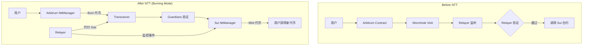
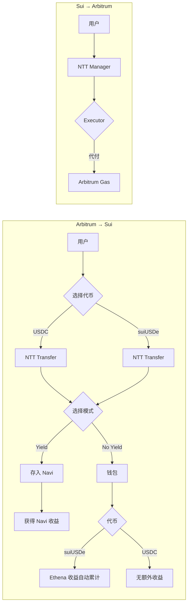
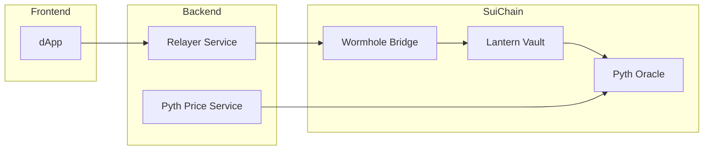

# Lantern Bridge 项目进度记录

## 2026-03-30 (下午)

### NTT 主网测试进度

#### 当前状态: ⚠️ 测试中遇到问题

#### 测试配置

| 配置项 | 值 |
|--------|-----|
| 源链 | Arbitrum |
| 目标链 | Sui |
| 代币 | USDC |
| 金额 | 1 USDC |
| 转账模式 | Manual (非自动) |
| 生息模式 | Yield (suiUSDe) |
| Sender | `0x5c2b3348b8d952cac541e01755bcfa9f562cbb6fd098287c11658ae9724692fe` |
| Recipient | `0x5c2b3348b8d952cac541e01755bcfa9f562cbb6fd098287c11658ae9724692fe` |

#### 测试发现的问题

##### 1. Executor API relayInstructions 格式错误
```
Invalid request for getQuote: "Invalid hex string for relayInstructions"
```
- **原因**: relayInstructions 需要 hex 编码格式，但当前发送的是 JSON 字符串
- **修复**: 将 relayInstructions 从 `{"requests":[...]}` 改为 hex 编码
```typescript
// 修复前
return JSON.stringify(layout);

// 修复后
return Buffer.from(JSON.stringify(layout)).toString('hex');
```

##### 2. NTT Manager transfer 函数签名歧义
```
ambiguous function description 
(i.e. matches "transfer(uint256,uint16,bytes32)", "transfer(uint256,uint16,bytes32,bytes32,bool,bytes)")
```
- **原因**: Arbitrum NTT Manager 有多个 `transfer` 重载函数
- **需要**: 指定完整的函数选择器 (function selector)

#### 已完成的代码修复

1. **Sui CLI 升级**: 升级到 v1.68.1 (mainnet-v1.68.1)
2. **Sui NTT 包部署**: ntt_common, ntt, wormhole_transceiver 已部署到 Mainnet
3. **Wormhole 版本统一**: ntt_common 和 wormhole_transceiver 的 Move.toml 从 `sui/testnet` 改为 `sui/mainnet`
4. **Executor relayInstructions 修复**: 改为 hex 编码格式
5. **Redis 服务修复**: 添加懒连接支持，避免阻塞

#### 待解决问题

- [ ] 修复 NTT Manager transfer 函数调用 - ✅ 已指定完整函数签名
- [ ] 确认 Executor API 的正确 relayInstructions 格式 - 仍在研究
- [ ] 测试手动模式转账

#### 2026-03-30 下午 - 代码修复

##### 1. NttTransferService transfer 函数修复
- **问题**: ethers 无法确定 `transfer` 函数重载
- **修复**: 使用完整函数签名 `transfer(uint256,uint16,bytes32,bytes32,bool,bytes)`
- **文件**: `lantern-backend/src/services/ntt-transfer.service.ts`

```typescript
// 修复前
const txData = this.nttManagerAbi.encodeFunctionData('transfer', [
  params.token === 'USDC' ? process.env.USDC_ADDRESS : '',
  params.amount,
  CHAIN_IDS[params.destChain],
  recipientBytes32,
  0, 0, 500000, '0x', // 错误的参数数量
]);

// 修复后
const txData = this.nttManagerAbi.encodeFunctionData(
  'transfer(uint256,uint16,bytes32,bytes32,bool,bytes)',
  [
    params.amount,
    CHAIN_IDS[params.destChain],
    recipientBytes32,
    refundBytes32,
    false, // shouldQueue
    '0x',  // transceiverInstructions
  ]
);
```

##### 2. NttExecutorService relayInstructions 修复
- **问题**: relayInstructions 需要 hex 编码格式
- **修复**: 实现简单的 hex 编码格式
- **文件**: `lantern-backend/src/services/ntt-executor.service.ts`

##### 3. Redis 服务懒连接修复
- **问题**: Redis 未初始化导致服务阻塞
- **修复**: 添加懒连接支持和错误处理
- **文件**: `lantern-backend/src/services/redis.service.ts`

##### 4. ethers 导入修复
- **问题**: ntt-executor.service.ts 缺少 ethers 导入
- **修复**: 添加 `import { ethers } from 'ethers'`

#### 相关文件

- `lantern-backend/src/services/ntt-transfer.service.ts` - NTT 转账服务
- `lantern-backend/src/services/ntt-executor.service.ts` - Executor 服务
- `lantern-backend/src/services/redis.service.ts` - Redis 服务

---

## 2026-03-30

### Sui NTT 主网部署进度

#### 当前状态: ✅ 全部完成

#### EVM (Arbitrum) 已部署 ✅

| 合约 | 地址 |
|------|------|
| NttManager | `0xF2C03bab1DbaaC3856B8776338A7039B52410b9f` |
| Token (USDC) | `0xaf88d065e77c8cC2239327C5EDb3A432268e5831` |
| WormholeTransceiver | `0x0e3BAa6a779085bd25A28fB5D3634Ce81Fa3519F` |
| Mode | Burning |

#### Sui 已部署的包 ✅

| 包名 | Package ID | 版本 | Transaction | Modules |
|------|-----------|------|-------------|---------|
| ntt_common | `0xbe8a75ebf46e3478e3c82475734418b0e236b20b30f502938774bb56b1f45f82` | v1 | `CngNtGZke5wKfzgNESWAZ4J6vSRfStzu8eoAsXFC7Eh1` | - |
| ntt | `0x650f78c6dd03afb036e203b9e78773d75f83a3843b3cfb1ac5ad3cbfedb155e5` | v1 | `EpJMq2sWpBpdve7kG5oYew4rkXG9fcpK2xrrsQEx42CT` | auth, inbox, mode, ntt, outbox, peer, rate_limit, setup, state, transceiver_registry, upgrades |
| wormhole_transceiver | `0xc7d5f825058c08e8716ca71c91e8cab013cf4f789e363f9215bdd64ce317495f` | v1 | `4XcuqMuppirfNFh6Vm1FmQULcmp6xpJBSjt1JraURTFA` | transceiver, wormhole_transceiver, wormhole_transceiver_info, wormhole_transceiver_registration |

#### 部署配置

- **Token**: `0x41d587e5336f1c86cad50d38a7136db99333bb9bda91cea4ba69115defeb1402::sui_usde::SUI_USDE`
- **Mode**: Burning (源链 burn，目标链 mint)
- **RPC**: `https://fullnode.mainnet.sui.io:443`
- **Gas Budget**: 500,000,000 MIST

#### 钱包地址

- **Deployer**: `0x5c2b3348b8d952cac541e01755bcfa9f562cbb6fd098287c11658ae9724692fe`

#### 重要修复

1. **Wormhole 版本统一**: 所有包的 Move.toml 中 Wormhole 依赖改为 `sui/mainnet`
2. **Sui CLI 升级**: 升级到 v1.68.1 (mainnet-v1.68.1)

#### 下一步

NTT 合约包已全部部署到 Sui Mainnet。需要进行初始化配置和跨链消息测试。

---

## 2026-03-29

### Sui NTT Contract 重构

#### 1. NTT 依赖配置

- **任务**: 在 Move.toml 中添加 Wormhole NTT 依赖
- **文件变更**:
  - `lantern-contracts/Move.toml` - 添加 Wormhole NTT 依赖
- **变更内容**:
  ```toml
  # Wormhole NTT (Native Token Transfer) - Sui integration
  # Reference: https://github.com/wormhole-foundation/native-token-transfers
  Wormhole = { git = "https://github.com/wormhole-foundation/wormhole.git", subdir = "sui/", rev = "daily/2025-01-08" }
  ```

#### 2. 新建 NTT 集成模块

- **任务**: 创建 `ntt_integration.move` 模块
- **文件变更**:
  - `lantern-contracts/sources/ntt_integration.move` - 新建
- **功能**:
  - `NttConfig` - NTT 全局配置 (relayers, admins, rate limits)
  - `NttToken<T>` - 代币的 NTT 配置
  - `ProcessedMessages` - 消息处理记录 (防重放)
  - `send_to_evm()` - Sui → EVM 发起跨链转账
  - `receive_from_evm()` - EVM → Sui 接收跨链转账
  - 速率限制 (Rate Limiting) 管理
  - Relayer 管理函数

#### 3. 更新 cross_chain.move

- **任务**: 在 cross_chain.move 中添加 NTT 支持
- **文件变更**:
  - `lantern-contracts/sources/cross_chain.move` - 添加 NTT Events 和 Functions
- **变更内容**:
  - 新增 NTT Events:
    - `NttOutboundEvent` - 跨链转账发起事件
    - `NttInboundEvent` - 跨链转账接收事件
    - `NttQueuedEvent` - 转账排队事件 (触发速率限制)
  - 新增 NTT 常量:
    - `NTT_MODE_LOCKING = 0`
    - `NTT_MODE_BURNING = 1`
  - 新增函数:
    - `ntt_withdraw_to_evm()` - NTT 模式提款
    - `ntt_receive_from_evm()` - NTT 模式接收
    - `address_to_wormhole_bytes()` - 地址格式转换
    - `wormhole_bytes_to_address()` - Wormhole 格式转 Sui 地址
    - `generate_ntt_sequence()` - 生成 NTT 序列号

#### 4. 更新 Relayer Service

- **任务**: 添加 NTT Event Monitoring & Relay 函数
- **文件变更**:
  - `lantern-backend/src/services/relayer.service.ts`
- **新增内容**:
  - NTT 常量:
    - `WORMHOLE_CHAIN_ID` - Wormhole 链 ID 映射
    - `NTT_MODE` - NTT 模式枚举
    - `NTT_DEFAULTS` - NTT 默认配置
  - 新增函数:
    - `listenNttOutboundEvents()` - 监听 Sui NttOutboundEvent
    - `listenEvmNttEvents()` - 监听 EVM NttManager 事件
    - `relayNttMessage()` - Relay Sui → EVM NTT 消息
    - `relayEvmNttToSui()` - Relay EVM → Sui NTT 消息
    - `getNttRateLimitStatus()` - 查询速率限制状态
    - `completeQueuedTransfers()` - 完成排队转账

### 技术决策

| 决策项 | 选择 | 理由 |
|--------|------|------|
| NTT Mode | Burning | 源链 burn, 目标链 mint, 最适合新代币 |
| 跨链模式 | 保留 Relayer | Relayer 代付 Gas, 监控跨链消息 |
| Replay Protection | NTT 内置 + 额外检查 | 双重保障 |
| Rate Limiting | 每链独立配置 | 灵活性高 |

### NTT 架构对比



### 待完成

- [ ] 对接 NTT SDK 实现实际的 NttManager 调用
- [ ] 集成 NTT CLI 进行部署
- [ ] 集成测试 (测试网)
- [ ] 主网部署

---

## 2026-03-27

### 完成的功能

#### 1. Wormhole NTT 跨链转账集成

- **任务**: 实现 Arbitrum ↔ Sui 的 USDC / suiUSDe 跨链转账
- **文件变更**:
  - `lantern-backend/src/services/ntt-transfer.service.ts` - NTT 转账核心服务
  - `lantern-backend/src/services/ntt-executor.service.ts` - Executor 代付服务
  - `lantern-backend/src/services/ntt-error-handler.service.ts` - 错误处理与重试机制
  - `lantern-backend/src/services/queue-processor.service.ts` - 队列处理器
  - `lantern-backend/src/services/relayer.service.ts` - 跨链 Relayer 服务
- **功能**:
  - Wormhole NTT Protocol 支持
  - Wormhole Executor Gas 代付
  - 多层容错策略 (L1-L4)
  - 队列转账自动处理
  - USDC 和 suiUSDe 双代币支持

#### 2. PTB Navi 生息集成

- **任务**: 实现跨链存款自动存入 Navi 生息
- **文件变更**:
  - `lantern-contracts/sources/yield.move` - 添加 PTB Navi 集成
  - `lantern-contracts/sources/cross_chain.move` - 添加 `receive_from_evm_with_yield`
- **功能**:
  - PTB 一步完成跨链 + 存入 Navi
  - 原子化操作保证一致性
  - 即时生息

#### 3. Sui USDe 生息路径

- **任务**: 支持跨链后持有 suiUSDe 自动获得 Ethena 收益
- **调研结果**:
  - suiUSDe 合约: `0x41d587e5336f1c86cad50d38a7136db99333bb9bda91cea4ba69115defeb1402::sui_usde::SUI_USDE`
  - 精度: 6 位小数
  - 年化收益: ~10-15% APY (由 Ethena 质押 ETH + 资金费率提供)
  - 特性: 持有即自动生息，无需额外操作
- **文件变更**:
  - `lantern-backend/src/services/ntt-transfer.service.ts`
    - 新增 `SupportedToken` 类型 (`'USDC' | 'suiUSDe'`)
    - 新增 `TOKEN_CONFIG` 代币配置
    - 新增辅助函数: `isYieldBearingToken()`, `getEstimatedYield()`, `getYieldInfo()`
  - `lantern-backend/src/services/relayer.service.ts`
    - 新增 `CrossChainRequest` 和 `CrossChainResponse` 接口
    - 更新 `transferWithNTT()` 支持代币参数
  - `lantern-contracts/sources/cross_chain.move`
    - 新增 `SUI_USDE_ADDRESS` 常量
    - 新增 `SuiUSDeDepositEvent` 事件
    - 新增 `MSG_TYPE_DEPOSIT_SUI_USDE` 消息类型
    - 新增 `receive_sui_usde_from_evm()` - 处理跨链 suiUSDe
    - 新增 `stake_sui_usde_for_yield()` - 本地 suiUSDe 质押
    - 新增 `is_sui_usde()` - 检查代币类型
    - 新增 `get_token_type_name()` - 获取代币名称
    - 新增 `get_yield_mode_description()` - 获取收益模式描述
- **功能**:
  - USDC 跨链: 可选择存入 Navi 或直接到钱包
  - suiUSDe 跨链: 持有即自动获得 Ethena 收益

### 技术决策

| 决策项 | 选择 | 理由 |
|--------|------|------|
| 跨链协议 | NTT + Executor | 支持 Arbitrum/Sui 双端，支持 Gas 代付 |
| 错误处理 | 多层容错 | L1 指数退避, L2 Manual, L3 队列, L4 告警 |
| 生息方案 | PTB + Navi | 原子化操作，即时生息 |
| USDe 生息 | 持有 suiUSDe | 内置生息 (~10-15% APY)，无需额外操作 |

### 代币收益对比

| 代币 | 生息方式 | 年化收益 | 操作复杂度 |
|------|----------|----------|------------|
| USDC | 存入 Navi | ~5-8% | 需要授权 |
| suiUSDe | 持有即生息 | ~10-15% | 无需额外操作 |

### 架构图



### NTT 错误处理策略

| 层级 | 策略 | 触发条件 |
|------|------|---------|
| L1 | 指数退避重试 | 网络超时 / Gas 估算失败 |
| L2 | 降级 Manual 模式 | Executor 服务不可用 |
| L3 | 启用队列 | Outbound/Inbound 容量超限 |
| L4 | 人工告警 | 超过阈值 |

### 经验总结

1. **NTT vs CCTP**: NTT 支持 Arbitrum 和 Sui 双端，Executor 提供完整 Gas 代付
2. **PTB 原子性**: 所有操作在一个 PTB 中完成，要么全部成功要么全部失败
3. **队列机制**: NTT 支持速率限制和队列，保证系统稳定性
4. **USDe vs USDC**: suiUSDe 内置生息机制，持有即获得收益 (~10-15%)，优于需要存入 Navi 的 USDC (~5-8%)

### 待完成

- [ ] 对接 Ethena API 获取实时收益率
- [x] 跨链合约 (cross_chain.move) 支持 suiUSDe 代币类型
- [ ] 集成测试（测试网）
- [ ] 主网部署
- [ ] 监控告警配置

---

## 2026-03-12

### 完成的功能

#### 1. Pyth 预言机集成

- **任务**: 在 Sui Move 合约中集成 Pyth 预言机
- **文件变更**:
  - `lantern-contracts/Move.toml` - 添加 Pyth SDK 依赖
  - `lantern-contracts/sources/pyth.move` - 新建预言机模块
  - `lantern-contracts/sources/vault.move` - 集成 TVL 计算函数
- **功能**:
  - 价格数据获取（USDC/USD, USDT/USD, SUI/USD）
  - 价格有效性验证（ freshness check, confidence check）
  - TVL 计算（以 USD 为单位）
  - 用户持仓价值计算

#### 2. Wormhole SDK 集成

- **任务**: 在后端集成 Wormhole SDK 实现跨链
- **文件变更**:
  - `lantern-backend/package.json` - 添加 @wormhole-foundation/sdk, @pythnetwork/pyth-sui-js
  - `lantern-backend/src/services/relayer.service.ts` - 更新跨链转账函数
  - `lantern-backend/src/services/pyth-price.service.ts` - 新建价格服务
- **功能**:
  - EVM ↔ Sui 资产跨链
  - 跨链消息处理
  - Pyth 价格数据获取和缓存

### 技术决策

| 决策项 | 选择 | 理由 |
|--------|------|------|
| 预言机 | Pyth | Sui 生态官方支持，200+ 价格源，低延迟 |
| 跨链协议 | Wormhole | 成熟稳定，支持多链，Relayer 可用 |
| 价格缓存 | Redis | 减少 API 调用，降低延迟 |

### 架构图



### 经验总结

1. **Pyth 与 Wormhole 不冲突**: Pyth 依赖 Wormhole 进行跨链消息传递，两者可共存
2. **拉取模型效率高**: Pyth 使用 pull 模型，按需获取价格，降低 gas 成本
3. **缓存策略重要**: 价格数据使用 Redis 缓存 30 秒，平衡实时性和性能

### 待完成

- [ ] 集成测试（测试网）
- [ ] 主网部署
- [ ] 监控告警配置
