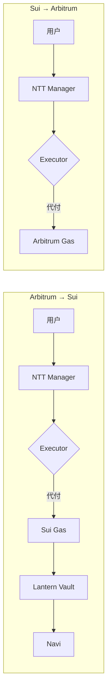
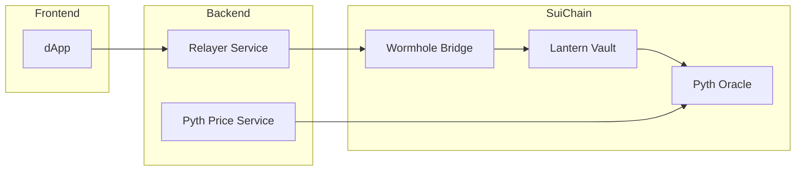

# Lantern Bridge 项目进度记录

## 2026-03-27

### 完成的功能

#### 1. Wormhole NTT 跨链转账集成

- **任务**: 实现 Arbitrum ↔ Sui 的 USDC 跨链转账
- **文件变更**:
  - `lantern-backend/src/services/ntt-transfer.service.ts` - NTT 转账核心服务
  - `lantern-backend/src/services/ntt-executor.service.ts` - Executor 代付服务
  - `lantern-backend/src/services/ntt-error-handler.service.ts` - 错误处理与重试机制
  - `lantern-backend/src/services/queue-processor.service.ts` - 队列处理器
- **功能**:
  - Wormhole NTT Protocol 支持
  - Wormhole Executor Gas 代付
  - 多层容错策略 (L1-L4)
  - 队列转账自动处理

#### 2. PTB Navi 生息集成

- **任务**: 实现跨链存款自动存入 Navi 生息
- **文件变更**:
  - `lantern-contracts/sources/yield.move` - 添加 PTB Navi 集成
  - `lantern-contracts/sources/cross_chain.move` - 添加 `receive_from_evm_with_yield`
- **功能**:
  - PTB 一步完成跨链 + 存入 Navi
  - 原子化操作保证一致性
  - 即时生息

### 技术决策

| 决策项 | 选择 | 理由 |
|--------|------|------|
| 跨链协议 | NTT + Executor | 支持 Arbitrum/Sui 双端，支持 Gas 代付 |
| 错误处理 | 多层容错 | L1 指数退避, L2 Manual, L3 队列, L4 告警 |
| 生息方案 | PTB + Navi | 原子化操作，即时生息 |

### 架构图

### NTT 错误处理策略

| 层级 | 策略 | 触发条件 |
|------|------|---------|
| L1 | 指数退避重试 | 网络超时 / Gas 估算失败 |
| L2 | 降级 Manual 模式 | Executor 服务不可用 |
| L3 | 启用队列 | Outbound/Inbound 容量超限 |
| L4 | 人工告警 | 超过阈值 |

### 经验总结

1. **NTT vs CCTP**: NTT 支持 Arbitrum 和 Sui 双端，Executor 提供完整 Gas 代付
2. **PTB 原子性**: 所有操作在一个 PTB 中完成，要么全部成功要么全部失败
3. **队列机制**: NTT 支持速率限制和队列，保证系统稳定性

---

## 2026-03-12

### 完成的功能

#### 1. Pyth 预言机集成

- **任务**: 在 Sui Move 合约中集成 Pyth 预言机
- **文件变更**:
  - `lantern-contracts/Move.toml` - 添加 Pyth SDK 依赖
  - `lantern-contracts/sources/pyth.move` - 新建预言机模块
  - `lantern-contracts/sources/vault.move` - 集成 TVL 计算函数
- **功能**:
  - 价格数据获取（USDC/USD, USDT/USD, SUI/USD）
  - 价格有效性验证（ freshness check, confidence check）
  - TVL 计算（以 USD 为单位）
  - 用户持仓价值计算

#### 2. Wormhole SDK 集成

- **任务**: 在后端集成 Wormhole SDK 实现跨链
- **文件变更**:
  - `lantern-backend/package.json` - 添加 @wormhole-foundation/sdk, @pythnetwork/pyth-sui-js
  - `lantern-backend/src/services/relayer.service.ts` - 更新跨链转账函数
  - `lantern-backend/src/services/pyth-price.service.ts` - 新建价格服务
- **功能**:
  - EVM ↔ Sui 资产跨链
  - 跨链消息处理
  - Pyth 价格数据获取和缓存

### 技术决策

| 决策项 | 选择 | 理由 |
|--------|------|------|
| 预言机 | Pyth | Sui 生态官方支持，200+ 价格源，低延迟 |
| 跨链协议 | Wormhole | 成熟稳定，支持多链，Relayer 可用 |
| 价格缓存 | Redis | 减少 API 调用，降低延迟 |

### 架构图

### 经验总结

1. **Pyth 与 Wormhole 不冲突**: Pyth 依赖 Wormhole 进行跨链消息传递，两者可共存
2. **拉取模型效率高**: Pyth 使用 pull 模型，按需获取价格，降低 gas 成本
3. **缓存策略重要**: 价格数据使用 Redis 缓存 30 秒，平衡实时性和性能

### 待完成

- [ ] 集成测试（测试网）
- [ ] 主网部署
- [ ] 监控告警配置
